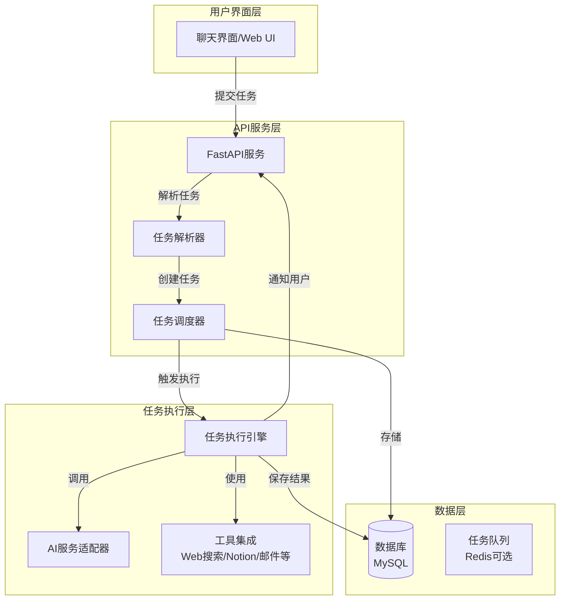

# 系统架构文档

本文档是TimerOS项目的架构设计基石，详细说明了系统的整体架构、核心组件、技术选型和设计决策。

## 1. 项目概述

### 1.1 项目定位

TimerOS是一个基于AI的智能定时任务系统，支持通过自然语言创建和管理定时任务。用户只需用自然语言描述任务需求，系统即可自动解析、调度和执行任务。

### 1.2 核心能力

- **自然语言理解**：使用LLM解析用户输入的自然语言任务描述
- **智能调度**：支持一次性任务和周期性任务（每天、每周、每月）
- **AI驱动执行**：使用AI进行信息研究、数据分析和报告生成
- **丰富工具集成**：集成网络搜索、邮件、Notion等外部服务
- **完整追踪**：记录任务执行历史和状态，便于监控和调试

### 1.3 可行性分析

**完全可行！** 这个项目结合了以下成熟技术：

- 自然语言处理（LLM解析任务描述）
- 任务调度系统（定时执行）
- AI任务执行（研究、分析、报告生成）
- 数据持久化（任务存储）

所有技术栈都是经过验证的成熟方案，可以稳定支撑项目需求。

## 2. 系统架构

### 2.1 架构设计原则

- **分层架构**：清晰的层次划分，便于维护和扩展
- **模块化设计**：每个模块职责单一，高内聚低耦合
- **可扩展性**：支持多种AI服务提供商和工具集成
- **可靠性**：完善的错误处理和日志记录机制

### 2.2 系统架构图



### 2.3 分层架构说明

系统采用四层架构设计：

#### 2.3.1 用户界面层
- **职责**：提供用户交互界面
- **实现**：Web UI、聊天界面、API客户端
- **特点**：与业务逻辑解耦，可灵活替换

#### 2.3.2 API服务层
- **职责**：处理HTTP请求、路由分发、参数验证
- **实现**：FastAPI框架
- **组件**：
  - FastAPI应用：提供RESTful API接口
  - 任务解析器：解析自然语言任务描述
  - 任务调度器：管理任务调度和执行

#### 2.3.3 任务执行层
- **职责**：执行具体的任务逻辑
- **实现**：任务执行引擎 + AI服务 + 工具集成
- **组件**：
  - 任务执行引擎：根据任务类型执行相应处理
  - AI服务适配器：统一的AI服务接口
  - 工具集成：网络搜索、邮件、Notion等

#### 2.3.4 数据层
- **职责**：数据持久化和存储
- **实现**：MySQL数据库 + 可选Redis队列
- **特点**：支持任务持久化、执行历史记录

## 3. 核心组件设计

### 3.1 任务解析模块 (TaskParser)

**位置**：`app/core/task_parser.py`

**职责**：
- 使用LLM解析自然语言任务描述
- 提取关键信息：执行时间、任务类型、任务参数
- 输出结构化任务对象

**设计特点**：
- **完全依赖LLM**：所有任务解析都通过LLM完成，不依赖规则匹配
  - 使用LLM理解自然语言，包括时间表达、任务类型、参数等
  - Prompt中包含当前时间信息，确保LLM能正确计算调度时间
- **时间感知**：在Prompt中提供详细的当前时间信息（日期、星期、时分等），避免LLM因不知道当前时间而错误计算调度时间
- **缓存机制**：缓存解析结果，避免重复解析相同描述
- **结果验证**：确保解析结果的完整性和正确性

**提取信息**：
- 执行时间（明天9点、每周一8点、每月1号）
- 任务类型（研究、分析、报告）
- 任务参数（24小时、前5名、网站流量）

### 3.2 任务调度模块 (TaskScheduler)

**位置**：`app/core/scheduler.py`

**职责**：
- 管理所有定时任务的调度
- 支持一次性任务和周期性任务
- 任务持久化到数据库

**设计特点**：
- **使用APScheduler**：成熟的Python任务调度框架
- **持久化支持**：任务信息存储在数据库，应用重启后自动加载
- **灵活调度**：
  - 一次性任务：使用`DateTrigger`，在指定时间执行一次
  - 周期性任务：使用`CronTrigger`，根据cron表达式重复执行
- **任务管理**：支持任务的暂停、恢复、删除操作

**支持的时间表达式**：
- 一次性任务：明天9点、后天下午2点等
- 周期性任务：每周一、每月1号、每天上午8点等

### 3.3 任务执行引擎 (TaskExecutor)

**位置**：`app/core/executor.py`

**职责**：
- 根据任务类型执行相应的处理逻辑
- 错误处理和重试机制
- 执行结果保存和通知

**支持的任务类型**：

1. **研究任务 (research_task)**
   - 使用网络搜索工具搜索相关信息
   - 使用AI分析搜索结果
   - 生成摘要报告
   - 发送通知（如需要）

2. **分析任务 (analysis_task)**
   - 收集数据
   - 使用数据分析工具分析
   - 使用AI生成分析报告
   - 发布结果（如需要）

3. **报告任务 (report_task)**
   - 收集数据
   - 使用AI生成报告
   - 发布到Notion或其他平台

**设计特点**：
- **策略模式**：根据任务类型调用相应的处理器
- **错误处理**：完善的异常捕获和错误记录
- **结果追踪**：记录执行时间、耗时、结果等详细信息

### 3.4 AI服务适配器 (AI Providers)

**位置**：`app/ai_providers/`

**职责**：
- 提供统一的AI服务接口
- 支持多种AI服务提供商
- 便于切换不同的AI服务

**设计特点**：
- **适配器模式**：定义统一的`BaseAIProvider`接口
- **多提供商支持**：
  - `OpenAIProvider`：支持GPT-4、GPT-3.5等
  - `AnthropicProvider`：支持Claude 3等
  - `LocalProvider`：支持本地模型（如Ollama）
- **统一API**：所有提供商实现相同的接口方法
  - `chat_completion()`：对话补全
  - `generate_text()`：文本生成

**优势**：
- 可以灵活切换AI服务提供商
- 支持本地模型，降低API成本
- 统一的错误处理和日志记录

### 3.5 工具集成模块 (Tools)

**位置**：`app/tools/`

**职责**：
- 集成各种外部服务和工具
- 为任务执行提供能力支持

**工具列表**：

1. **网络搜索工具 (WebSearchTool)**
   - 使用SerpAPI或Google Search API
   - 支持新闻搜索、时间范围过滤
   - 用于研究任务中搜索信息

2. **邮件客户端 (EmailClient)**
   - SMTP协议发送邮件
   - 支持文本和HTML格式
   - 用于任务执行结果通知

3. **Notion客户端 (NotionClient)**
   - Notion API集成
   - 创建和更新页面
   - 用于报告任务发布结果

4. **数据分析工具 (DataAnalyzer)**
   - 数据统计分析
   - 生成数据摘要
   - 用于分析任务处理数据

### 3.6 数据模型 (Models)

系统采用**双层模型设计**：SQLAlchemy ORM模型用于数据库映射，Pydantic模型用于API层数据验证和序列化。

#### 3.6.1 SQLAlchemy ORM模型（数据库层）

**位置**：`app/core/models.py`

**核心模型**：

1. **Task（任务表）**
   - 存储任务基本信息
   - 字段：id, name, description, task_type, schedule, cron_expression, is_recurring, status, params, created_time, updated_time
   - 支持软删除（deleted_time）

2. **TaskExecution（执行记录表）**
   - 记录每次任务执行的详细信息
   - 字段：id, task_id, status, result, error_message, execution_time, duration_seconds, created_time
   - 用于任务执行历史追踪和问题排查

**设计特点**：
- 使用SQLAlchemy ORM进行数据库映射
- 所有表使用utf8mb4字符集
- 时间字段使用`_time`后缀（created_time, updated_time）
- 不使用物理外键约束，关系在应用层维护
- 不在ORM模型中定义索引和关系

#### 3.6.2 Pydantic模型（API层）

**位置**：`app/core/schemas.py`

**核心模型**：

1. **请求模型**：
   - `TaskCreate`：创建任务请求，接收自然语言任务描述
   - `TaskUpdate`：更新任务请求，所有字段可选

2. **响应模型**：
   - `TaskResponse`：任务响应，包含所有任务字段
   - `TaskExecutionResponse`：执行记录响应
   - `TaskListResponse`：任务列表响应，包含分页信息

**设计特点**：
- **所有API接口都使用Pydantic模型进行数据验证和序列化**
- 自动进行类型验证和数据转换
- 支持从SQLAlchemy模型自动转换（`from_attributes = True`）
- 提供详细的字段描述和验证规则
- 自动生成OpenAPI/Swagger文档

**使用场景**：
- API请求参数验证（请求体、查询参数）
- API响应数据序列化
- 数据转换（SQLAlchemy模型 ↔ Pydantic模型）
- 自动生成API文档

**示例**：
```python
# API路由中使用Pydantic模型
@router.post("", response_model=TaskResponse)
async def create_task(task_data: TaskCreate):
    # task_data已通过Pydantic验证
    # 返回的Task对象会自动转换为TaskResponse
    pass
```

### 3.7 API接口 (API Routes)

**位置**：`app/api/routes/`

**核心接口**：

**任务管理**：
- `POST /api/tasks`：创建任务（接收自然语言输入）
- `GET /api/tasks`：获取任务列表（支持过滤和分页）
- `GET /api/tasks/{id}`：获取任务详情
- `PUT /api/tasks/{id}`：更新任务
- `DELETE /api/tasks/{id}`：删除任务（软删除）
- `POST /api/tasks/{id}/execute`：手动执行任务

**执行记录**：
- `GET /api/executions`：查询执行记录列表
- `GET /api/executions/{id}`：获取执行记录详情

**设计特点**：
- RESTful API设计
- **使用Pydantic模型进行请求/响应验证和序列化**
- 统一的错误处理
- 自动生成API文档（Swagger UI）
- 所有API接口的输入输出都使用Pydantic模型

## 4. 技术栈选择

### 4.1 核心技术

| 技术 | 选择 | 理由 |
|------|------|------|
| **Web框架** | FastAPI | 异步支持、自动文档、高性能 |
| **任务调度** | APScheduler | 支持持久化、灵活的时间表达式 |
| **数据库** | MySQL | 成熟稳定、性能优秀 |
| **ORM** | SQLAlchemy | 功能强大、支持复杂查询 |
| **数据库驱动** | pymysql | 纯Python实现、兼容性好 |

### 4.2 AI服务SDK

- `openai`：OpenAI官方SDK
- `anthropic`：Anthropic官方SDK
- `ollama`：本地模型支持（可选）

### 4.3 工具库

- `httpx`：异步HTTP客户端
- `requests`：同步HTTP客户端（备用）
- `beautifulsoup4`：网页解析
- `pandas`：数据分析

### 4.4 开发工具

- `black`：代码格式化
- `isort`：导入排序
- `ruff`：代码检查
- `mypy`：类型检查
- `pytest`：测试框架

## 5. 实现流程

### 5.1 任务创建流程

**示例**：用户输入"明天上午9点运行此任务：研究过去24小时内的热门AI新闻并向我发送摘要"

**流程步骤**：

1. **用户输入**
   ```
   "明天上午9点运行此任务：研究过去24小时内的热门AI新闻并向我发送摘要"
   ```

2. **任务解析**
   ```python
   {
     "schedule": "2024-01-15T09:00:00",
     "task_type": "research_task",
     "params": {
       "topic": "热门AI新闻",
       "time_range": "过去24小时",
       "action": "发送摘要",
       "send_email": true
     },
     "recurring": false
   }
   ```

3. **任务创建**
   - 创建Task对象
   - 保存到数据库
   - 注册到调度器

4. **任务调度**
   - 调度器在指定时间触发执行
   - 调用任务执行引擎

### 5.2 任务执行流程

**到达执行时间后**：

1. **任务执行开始**
   - 更新任务状态为`running`
   - 创建执行记录

2. **执行任务逻辑**（以研究任务为例）
   - 使用网络搜索工具搜索"AI新闻 24小时"
   - 获取搜索结果（标题、摘要、链接）
   - 使用AI分析搜索结果，生成摘要
   - 格式化结果

3. **发送通知**（如需要）
   - 通过邮件发送摘要
   - 或通过API返回结果

4. **保存结果**
   - 更新执行记录（状态、结果、耗时）
   - 更新任务状态（completed或failed）

### 5.3 周期性任务流程

**示例**：每周一上午8点分析竞争对手

1. **任务创建**
   - 设置`is_recurring=True`
   - 设置`cron_expression="0 8 * * 1"`（每周一8点）

2. **调度执行**
   - 调度器根据cron表达式定期触发
   - 每次执行后，任务状态保持`pending`，等待下次执行

3. **执行历史**
   - 每次执行都创建新的执行记录
   - 可以查看历史执行情况

## 6. 数据流设计

### 6.1 任务创建数据流

```
用户输入（自然语言）
    ↓
任务解析器（LLM解析，包含当前时间信息）
    ↓
结构化任务对象
    ↓
数据库（保存Task）
    ↓
调度器（注册任务）
    ↓
等待执行时间
```

### 6.2 任务执行数据流

```
调度器触发
    ↓
任务执行引擎
    ↓
工具调用（搜索/分析）
    ↓
AI服务调用（生成内容）
    ↓
结果处理
    ↓
通知发送（邮件/Notion）
    ↓
数据库（保存执行记录）
```

## 7. 部署方案

### 7.1 本地部署

**适用场景**：开发、测试、小规模使用

**配置**：
- MySQL数据库（本地实例）
- APScheduler在后台线程运行
- 单进程运行

**优势**：
- 部署简单
- 适合开发和测试
- 资源占用少

### 7.2 云部署

**适用场景**：生产环境、大规模使用

**配置**：
- MySQL数据库（云数据库服务，如RDS）
- 可选Redis作为任务队列（提高并发能力）
- 使用systemd或supervisor管理进程
- 支持Docker容器化部署
- Nginx反向代理

**优势**：
- 高可用性
- 易于扩展
- 便于监控和维护

**架构建议**：
```
Nginx (反向代理)
    ↓
Uvicorn (应用服务器，多进程)
    ↓
MySQL (云数据库)
    ↓
Redis (可选，任务队列)
```

## 8. 关键挑战与解决方案

### 8.1 时间解析准确性

**挑战**：自然语言时间表达复杂多样，如"明天"、"下周一"、"每月1号"等，且LLM可能不知道当前时间

**解决方案**：
- **完全依赖LLM**：使用LLM深度理解自然语言时间表达
- **时间感知Prompt**：在Prompt中提供详细的当前时间信息（当前日期、星期、时分等），确保LLM能正确计算调度时间
- **结果验证**：确保解析的时间格式正确
- **错误处理**：解析失败时给出明确的错误提示

### 8.2 任务执行可靠性

**挑战**：任务执行可能因网络、API限制等原因失败

**解决方案**：
- **重试机制**：失败任务自动重试（可配置重试次数）
- **错误日志**：详细记录错误信息和堆栈
- **状态追踪**：实时更新任务状态，便于监控
- **执行历史**：保存每次执行记录，便于问题排查

### 8.3 AI成本控制

**挑战**：AI API调用成本较高，需要控制使用量

**解决方案**：
- **支持本地模型**：使用Ollama等本地模型，无需API费用
- **Prompt优化**：精简prompt，减少token使用
- **缓存机制**：解析结果缓存，避免重复调用相同描述

### 8.4 并发执行

**挑战**：多个任务同时执行时，需要避免阻塞和资源竞争

**解决方案**：
- **异步执行**：使用FastAPI的异步特性
- **任务队列**：可选Redis作为任务队列，提高并发能力
- **连接池**：数据库连接池，避免连接耗尽
- **资源限制**：可配置最大并发任务数

## 9. 扩展性设计

### 9.1 新增任务类型

**扩展方式**：
1. 在`TaskExecutor`中添加新的`_execute_xxx_task()`方法
2. 在任务解析器中添加新任务类型的识别逻辑
3. 更新相关文档

### 9.2 新增AI提供商

**扩展方式**：
1. 继承`BaseAIProvider`基类
2. 实现`chat_completion()`和`generate_text()`方法
3. 在依赖注入中注册新提供商

### 9.3 新增工具集成

**扩展方式**：
1. 在`app/tools/`目录下创建新工具类
2. 在任务执行引擎中集成新工具
3. 更新工具文档

## 10. 安全考虑

### 10.1 API安全

- 使用HTTPS传输
- API密钥通过环境变量管理
- 输入验证和参数过滤

### 10.2 数据安全

- 数据库连接使用加密
- 敏感信息不记录日志
- 定期备份数据库

### 10.3 访问控制

- 可扩展用户认证和授权机制
- API访问频率限制

## 11. 性能优化

### 11.1 数据库优化

- 合理的索引设计
- 连接池配置
- 查询优化

### 11.2 缓存策略

- 任务解析结果缓存
- 数据库查询结果缓存（如需要）

### 11.3 异步处理

- 使用异步IO提高并发能力
- 长时间任务使用后台任务队列

## 12. 监控和运维

### 12.1 日志系统

- 结构化日志（JSON格式）
- 多级别日志（DEBUG、INFO、WARNING、ERROR、CRITICAL）
- 日志文件轮转

### 12.2 监控指标

- 任务执行成功率
- 任务执行耗时
- API响应时间
- 数据库连接状态

### 12.3 告警机制

- 任务执行失败告警
- 系统异常告警
- 资源使用告警

## 13. 未来扩展方向

### 13.1 功能扩展

- 用户认证和授权
- 任务模板和预设
- 任务依赖关系
- 任务优先级队列
- 多租户支持

### 13.2 技术优化

- 分布式任务调度
- 任务执行结果可视化
- 更丰富的工具集成
- 更智能的任务推荐

## 14. 总结

TimerOS采用分层架构设计，通过模块化组件实现灵活的任务管理。核心设计理念：

1. **AI驱动**：充分利用LLM理解自然语言
2. **灵活调度**：支持各种时间表达和任务类型
3. **可靠执行**：完善的错误处理和结果追踪
4. **易于扩展**：模块化设计，便于添加新功能

本架构文档是项目开发的基石，所有开发工作都应遵循此架构设计。
