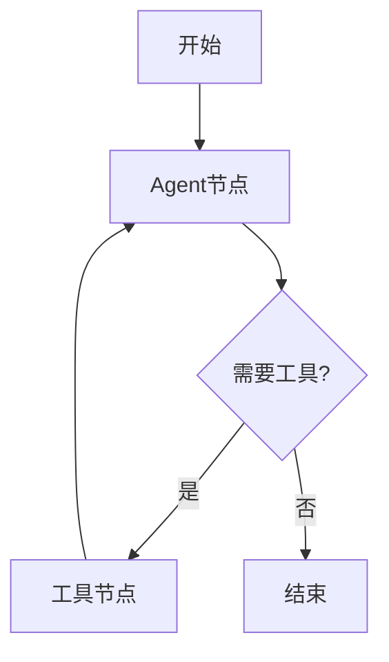

# 任务执行模块

## 1. 模块概述

### 1.1 模块职责

任务执行模块使用 **LangGraph Agent** 自主决策执行各种类型的任务：

- 研究任务：搜索信息、生成摘要
- 分析任务：分析数据、生成报告
- 报告任务：生成报告并发布到Notion等平台

Agent会根据任务描述自动选择合适的工具来完成任务，无需手动编排工具调用。

### 1.2 模块位置

- 执行器：`app/core/executor.py`
- Agent：`app/agents/task_agent.py`
- 工具：`app/tools/langchain_tools.py`

### 1.3 依赖关系

- `langchain_core.language_models.chat_models.BaseChatModel`: LangChain Chat模型
- `app.agents.task_agent.TaskAgent`: LangGraph Agent
- `app.tools.langchain_tools`: LangChain工具
- `app.core.models`: 数据模型

## 2. API文档

### 2.1 类/函数列表

- `TaskExecutor`: 任务执行器类
  - `execute_task()`: 执行任务（异步方法）
  - `execute_task_with_streaming()`: 流式执行任务

- `TaskAgent`: 任务执行Agent
  - `execute()`: 执行任务
  - `stream_execute()`: 流式执行

### 2.2 详细API说明

#### TaskExecutor

任务执行器类，使用LangGraph Agent自主决策执行任务。

**构造函数**:
```python
def __init__(
    self,
    llm: BaseChatModel,
    tools: Optional[List[BaseTool]] = None,
)
```

**方法列表**:

- `async execute_task(task_id, db) -> Dict[str, Any]`: 执行任务
- `async execute_task_with_streaming(task_id, db)`: 流式执行任务

**示例**:

```python
from app.llm.factory import get_chat_model
from app.core.executor import TaskExecutor
from app.core.database import SessionLocal

llm = get_chat_model()
executor = TaskExecutor(llm=llm)

db = SessionLocal()
try:
    result = await executor.execute_task(task_id=1, db=db)
    print(f"执行成功: {result['status']}")
finally:
    db.close()
```

#### TaskAgent

LangGraph任务执行Agent，自主决策使用工具完成任务。

**构造函数**:
```python
def __init__(
    self,
    llm: BaseChatModel,
    tools: Optional[List[BaseTool]] = None,
)
```

**方法**:
- `async execute(task_description, task_params) -> Dict[str, Any]`
- `async stream_execute(task_description, task_params)` -> AsyncGenerator

**示例**:
```python
from app.agents.task_agent import TaskAgent
from app.llm.factory import get_chat_model
from app.tools.langchain_tools import get_all_tools

llm = get_chat_model()
agent = TaskAgent(llm=llm, tools=get_all_tools())

result = await agent.execute(
    task_description="搜索最新的AI新闻并生成摘要",
    task_params={"topic": "AI新闻"}
)
```

## 3. 设计说明

### 3.1 设计思路

采用 **自主决策Agent** 模式：

```
任务描述 → Agent分析 → 自主选择工具 → 执行 → 分析结果 → 决定下一步 → 最终输出
```

Agent会根据任务描述自动决定：
- 需要搜索哪些信息
- 使用哪些工具
- 如何组合工具输出
- 何时发送通知

### 3.2 LangGraph架构



**节点说明**:
- **Agent节点**: 调用LLM决定下一步行动
- **工具节点**: 执行工具调用
- **条件边**: 根据LLM输出决定是继续还是结束

### 3.3 工具选择策略

根据任务类型预选相关工具：

| 任务类型 | 工具集 |
|---------|-------|
| research_task | web_search, search_news, send_email |
| analysis_task | analyze_data, generate_data_summary, send_email |
| report_task | web_search, analyze_data, create_notion_page, send_email |

Agent可以从工具集中自主选择使用哪些工具。

### 3.4 执行流程

```
1. 接收任务ID
2. 从数据库加载任务信息
3. 更新状态为running
4. 构建任务提示词
5. 创建Agent并执行
6. Agent自主决策使用工具
7. 保存执行结果
8. 更新任务状态
```

## 4. 配置说明

### 4.1 环境变量

依赖LLM和工具服务的配置：

```bash
# LLM配置
AI_PROVIDER=openai
OPENAI_API_KEY=your-key

# 工具配置
SERPAPI_KEY=your-key        # 网络搜索
SMTP_HOST=smtp.example.com  # 邮件发送
NOTION_API_KEY=your-key     # Notion集成
```

### 4.2 获取执行器实例

推荐通过依赖注入：

```python
from app.api.dependencies import get_task_executor

executor = get_task_executor()
result = await executor.execute_task(task_id=1, db=db)
```

## 5. 使用示例

### 5.1 基本使用

```python
from app.llm.factory import get_chat_model
from app.core.executor import TaskExecutor
from app.core.database import SessionLocal

llm = get_chat_model()
executor = TaskExecutor(llm=llm)

db = SessionLocal()
try:
    result = await executor.execute_task(task_id=1, db=db)
    print(f"执行结果: {result}")
finally:
    db.close()
```

### 5.2 直接使用Agent

```python
from app.agents.task_agent import TaskAgent
from app.llm.factory import get_chat_model

llm = get_chat_model()
agent = TaskAgent(llm=llm)

# 执行自定义任务
result = await agent.execute(
    task_description="搜索过去24小时的AI新闻，生成摘要，并通过邮件发送",
    task_params={
        "topic": "AI新闻",
        "email_addresses": ["user@example.com"]
    }
)

print(result["final_response"])
```

### 5.3 流式执行

```python
async for event in agent.stream_execute(task_description="分析竞争对手"):
    print(f"事件: {event}")
```

### 5.4 自定义工具集

```python
from app.tools.langchain_tools import get_research_tools

# 只使用研究相关工具
agent = TaskAgent(llm=llm, tools=get_research_tools())
result = await agent.execute("搜索AI新闻")
```

## 6. 常见问题

### Q: Agent如何选择工具？

A: Agent（LLM）会分析任务描述，然后决定使用哪些工具。工具的docstring会告诉Agent每个工具的用途。

### Q: 任务执行失败怎么办？

A: 执行失败会记录错误信息到数据库，任务状态会更新为failed。Agent会尝试处理错误，如果无法恢复则终止执行。

### Q: 如何添加新工具？

A: 在`app/tools/langchain_tools.py`中添加新的`@tool`装饰的函数：

```python
@tool
async def my_new_tool(param: str) -> str:
    """工具描述，Agent会看到这个描述来决定何时使用此工具。"""
    # 实现逻辑
    return result
```

然后将其添加到`get_all_tools()`函数的返回列表中。

### Q: Agent会无限循环吗？

A: 不会。LangGraph会在以下情况结束：
- LLM输出不包含工具调用
- 达到最大迭代次数（可配置）

### Q: 执行是同步还是异步？

A: 完全异步，使用`async/await`，不会阻塞其他任务。

## 7. 更新日志

- 2026-01-04: 迁移到LangGraph Agent，支持自主决策工具选择
- 2024-01-15: 初始版本，支持研究任务、分析任务、报告任务
