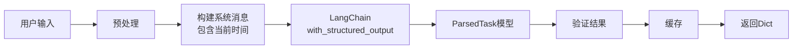

# 任务解析模块

## 1. 模块概述

### 1.1 模块职责

任务解析模块负责将用户输入的自然语言任务描述解析为结构化的任务对象。主要功能包括：

- 解析自然语言时间表达式（如"明天上午9点"、"每周一8点"）
- 识别任务类型（研究任务、分析任务、报告任务）
- 提取任务参数（时间范围、数量限制等）
- 生成cron表达式（周期性任务）

### 1.2 模块位置

- 文件路径：`app/core/task_parser.py`
- 类名：`TaskParser`
- Pydantic模型：`ParsedTask`

### 1.3 依赖关系

- `langchain_core.language_models.chat_models.BaseChatModel`: LangChain Chat模型
- `pydantic.BaseModel`: Pydantic模型（用于结构化输出）
- `app.utils.exceptions.TaskParseError`: 自定义异常
- `app.utils.logger`: 日志工具

## 2. API文档

### 2.1 类/函数列表

- `ParsedTask`: 解析结果Pydantic模型
- `TaskParser`: 任务解析器主类
  - `__init__(llm)`: 初始化解析器
  - `parse(description)`: 解析任务描述（异步方法）
  - `clear_cache()`: 清空缓存

### 2.2 详细API说明

#### ParsedTask

解析后的任务结构，使用Pydantic模型定义。

**字段**:
- `schedule: str` - 执行时间，ISO格式
- `task_type: Literal["research_task", "analysis_task", "report_task"]` - 任务类型
- `params: Dict[str, Any]` - 任务参数
- `recurring: bool` - 是否为周期性任务
- `cron_expression: Optional[str]` - cron表达式

```python
from app.core.task_parser import ParsedTask

task = ParsedTask(
    schedule="2024-01-15T09:00:00",
    task_type="research_task",
    params={"topic": "AI新闻"},
    recurring=False
)
```

#### TaskParser

任务解析器类，使用LangChain结构化输出解析自然语言任务描述。

**方法列表**:

- `async parse(description: str) -> Dict[str, Any]`: 解析任务描述
- `_preprocess_description(description: str) -> str`: 预处理描述文本
- `_validate_parse_result(result: Dict) -> Dict[str, Any]`: 验证解析结果
- `clear_cache() -> None`: 清空解析缓存

**示例**:

```python
from app.llm.factory import get_chat_model
from app.core.task_parser import TaskParser

# 创建解析器
llm = get_chat_model()
parser = TaskParser(llm=llm)

# 解析任务描述
result = await parser.parse("明天上午9点研究AI新闻")
print(result)
# {
#     "schedule": "2024-01-15T09:00:00",
#     "task_type": "research_task",
#     "params": {"topic": "AI新闻"},
#     "recurring": False,
#     "cron_expression": None
# }
```

## 3. 设计说明

### 3.1 设计思路

采用 **LangChain结构化输出** 策略：

1. **预处理**：清理输入文本，移除多余空格和特殊字符
2. **结构化输出**：使用 `llm.with_structured_output(ParsedTask)` 确保输出格式正确
3. **时间感知Prompt**：系统提示词中包含详细的当前时间信息
4. **结果验证**：确保解析结果的完整性和正确性
5. **缓存机制**：缓存解析结果，避免重复解析相同描述

**设计优势**：
- **类型安全**：使用Pydantic模型，编译时即可发现类型错误
- **格式保证**：LangChain结构化输出确保返回正确的JSON格式
- **时间感知**：Prompt中包含当前时间信息，避免时间计算错误
- **灵活性强**：能理解各种自然语言时间表达

### 3.2 关键流程

```
用户输入 → 预处理 → 构建消息 → LangChain结构化输出 → 验证 → 缓存 → 返回
```

### 3.3 数据流



### 3.4 Prompt设计

系统提示词包含以下关键信息：

```
当前时间信息:
- 当前时间：2024-01-15 10:30:00
- 当前日期：2024-01-15
- 当前星期：周一
- 当前年份、月份、日期、小时、分钟

时间计算说明:
- "明天" 指的是 2024-01-16
- "下周X" 需要根据当前星期计算
- "每月X号" 需要根据当前日期计算

任务类型说明:
- research_task: 研究任务
- analysis_task: 分析任务
- report_task: 报告任务
```

## 4. 配置说明

### 4.1 环境变量

无需额外环境变量，使用传入的LangChain模型配置。

### 4.2 获取解析器实例

推荐通过依赖注入获取：

```python
from app.api.dependencies import get_task_parser

parser = get_task_parser()
result = await parser.parse("明天9点研究AI新闻")
```

## 5. 使用示例

### 5.1 基本使用

```python
from app.llm.factory import get_chat_model
from app.core.task_parser import TaskParser

llm = get_chat_model()
parser = TaskParser(llm=llm)

# 解析一次性任务
result = await parser.parse("明天上午9点研究AI新闻")

# 解析周期性任务
result = await parser.parse("每周一上午8点分析竞争对手")
```

### 5.2 使用不同模型

```python
from app.llm.factory import get_chat_model

# 使用Anthropic
llm = get_chat_model(provider="anthropic", model="claude-3-sonnet")
parser = TaskParser(llm=llm)
result = await parser.parse("每月1号分析网站流量")
```

### 5.3 缓存管理

```python
parser = TaskParser(llm=llm)

# 解析（结果会被缓存）
result1 = await parser.parse("明天9点研究新闻")

# 相同描述直接从缓存获取
result2 = await parser.parse("明天9点研究新闻")

# 清空缓存
parser.clear_cache()
```

## 6. 常见问题

### Q: 解析失败怎么办？

A: 检查任务描述是否包含明确的时间信息。如果仍然失败，查看日志了解详细错误信息。可能的原因：
- LLM返回格式不正确（稀少情况）
- 网络连接问题
- API限制

### Q: 支持哪些时间表达式？

A: 支持所有自然语言时间表达，包括但不限于：
- 相对时间："明天"、"后天"、"下周X"、"下个月X号"
- 绝对时间："2024年1月15日上午9点"
- 周期性："每周一"、"每月1号"、"每天上午8点"
- 复杂表达："下个工作日"、"每季度第一天"等

### Q: 如何确保LLM返回正确格式？

A: 使用LangChain的 `with_structured_output()` 功能：
```python
structured_llm = llm.with_structured_output(ParsedTask)
result = await structured_llm.ainvoke(messages)
# result 直接是 ParsedTask 实例
```

### Q: 解析结果可以缓存吗？

A: 是的，解析器内部有缓存机制，相同描述的解析结果会被缓存。使用 `clear_cache()` 可以清空缓存。

## 7. 更新日志

- 2026-01-04: 迁移到LangChain 1.0，使用结构化输出替代手动JSON解析
- 2024-12-30: 重构为完全依赖LLM解析，移除所有规则匹配逻辑
- 2024-01-15: 初始版本，支持基本的时间解析和任务类型识别
